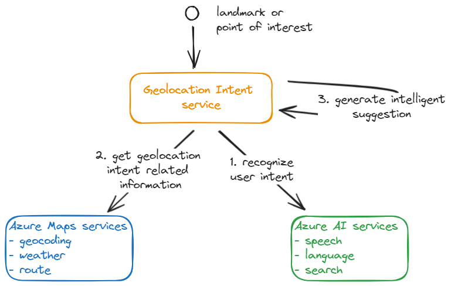
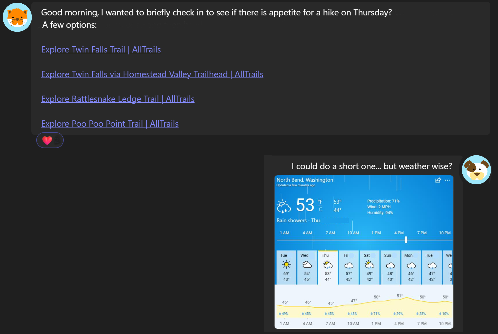
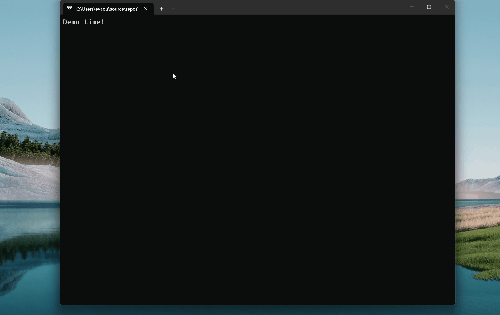
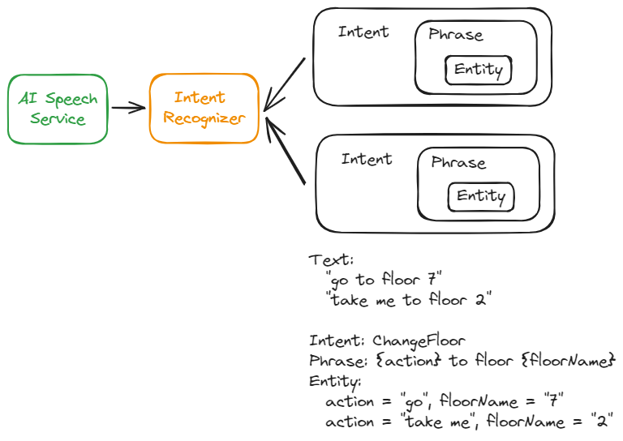
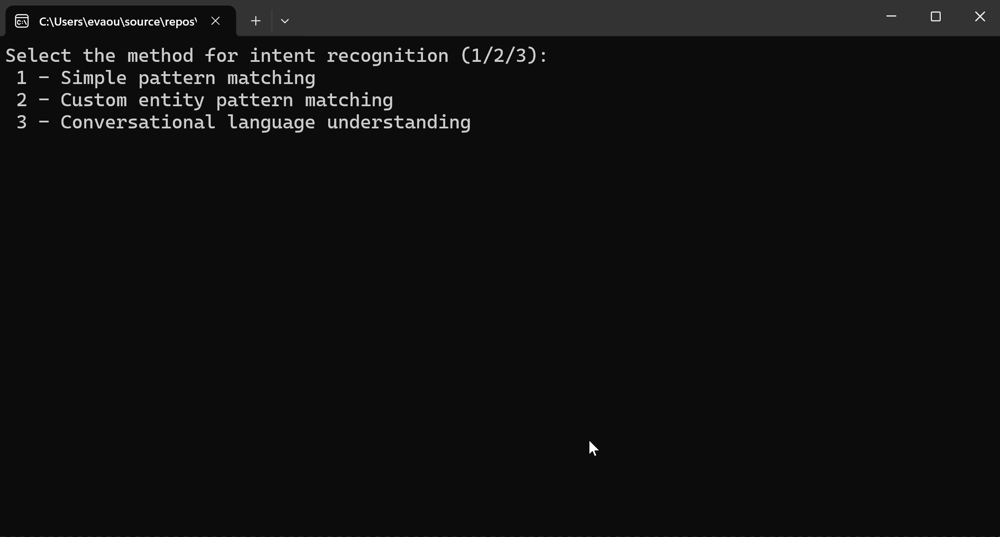
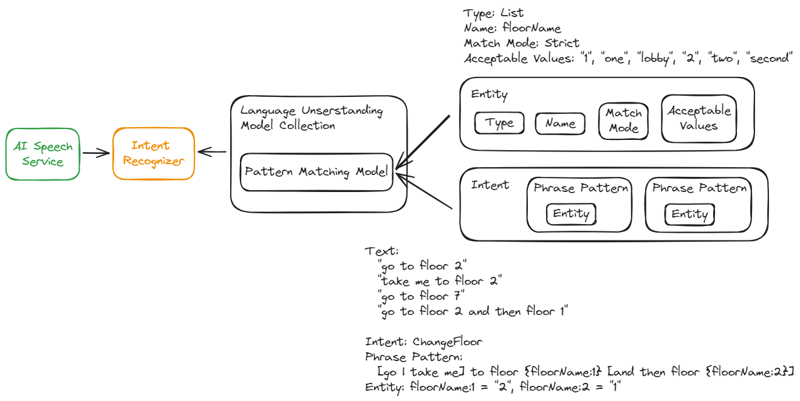
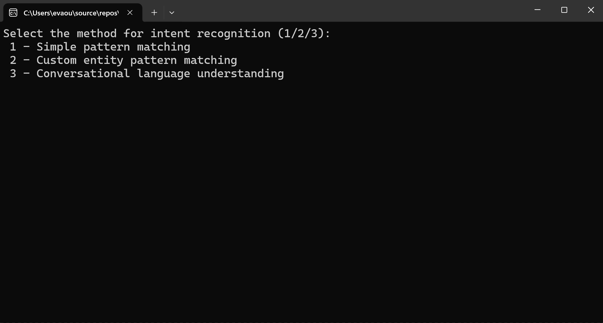
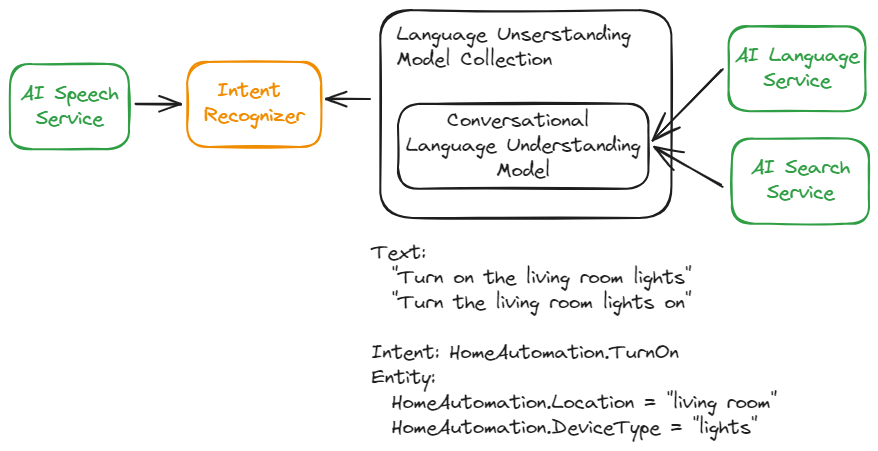
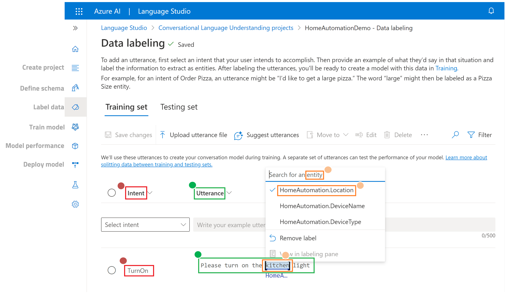

# Geolocation Intent with Azure AI Services

<!-- vscode-markdown-toc -->
* [What's Geolocation Intent service?](#WhatsGeolocationIntentservice)
* [When do we need Geolocation Intent service?](#WhendoweneedGeolocationIntentservice)
* [Intent Recognition Solutions](#IntentRecognitionSolutions)
	* [Simple Pattern Matching](#SimplePatternMatching)
	* [Custom Entity Pattern Matching](#CustomEntityPatternMatching)
	* [Conversational Language Understanding](#ConversationalLanguageUnderstanding)
* [Demo Setup](#DemoSetup)
* [Reference](#Reference)

<!-- vscode-markdown-toc-config
	numbering=false
	autoSave=true
	/vscode-markdown-toc-config -->
<!-- /vscode-markdown-toc -->

## What's Geolocation Intent service?

Geolocation Intent service is a total solution, which takes user's target geolocation as input, such as landmarks or point of interest. The service can recognize user's intent and then acquire intent-related and user-desired additional information. Finally, geolocation intent service generates an intelligent suggestion with all collected information for users to make a better decision.

### Architecture

## When do we need Geolocation Intent service?

Here come a scenario to help us understand the demand and then a demo to show how Geolocation Intent service can support us.

### Scenario

One day kitten and puppy are happy to meet each other and they want to go hiking together. Kitten proposes a list of hiking spots and puppy would like to go hiking on a sunny day. Then puppy checks the weather forecast this week and share the information with kitten.

### Demo

## Intent Recognition Solutions

There are 3 Intent Recognition solutions by leveraging Azure AI services.

### Simple Pattern Matching

#### Architecture

#### Demo

### Custom Entity Pattern Matching

#### Architecture

#### Demo

### Conversational Language Understanding

#### Architecture

#### Demo

#### Azure AI Language Studio

To have a ready Conversational Language Understanding model, this solution is required to use Azure AI Language studio to create a project, define intent and entity schema, label data in utterance, train model, evaluate model performance, and deploy the model.

## Demo Setup

1. Create an Azure AI Speech service
1. Create an Azure AI Language service, which will create an Azure AI Search service automatically
1. Create a Conversational Language Understanding project, train the model, and deploy the model in Azure AI Language studio
1. Set the values in appsettings.json
1. Open GeolocationIntent.sln or IntentRecognition.sln in Visual Studio 2022
1. In Solution Explorer, right click Solution and run the following steps in order
	1. Clean Solution
	1. Restore Nuget Packages
	1. Build Solution
1. Start Debugging GeolocationIntent or IntentRecognition

## Reference

- [Azure AI Intent Recognition](https://learn.microsoft.com/en-us/azure/ai-services/speech-service/intent-recognition)
- [Azure AI Language studio](https://language.cognitive.azure.com/home)
- [Azure Maps Route Directions service](https://learn.microsoft.com/en-us/rest/api/maps/route/post-directions?view=rest-maps-2023-10-01-preview&tabs=HTTP)
- [Azure Maps Geocoding service](https://learn.microsoft.com/en-us/rest/api/maps/search/get-geocoding?view=rest-maps-2023-06-01&tabs=HTTP)
- [Azure Maps Weather service](https://learn.microsoft.com/en-us/rest/api/maps/weather/get-hourly-forecast?view=rest-maps-2023-06-01&tabs=HTTP)